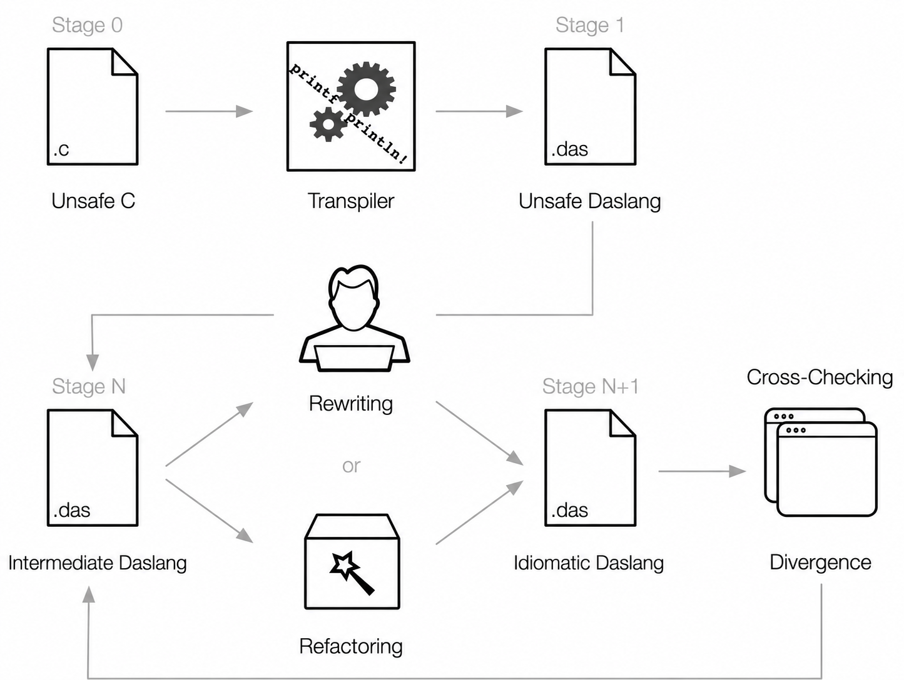

# c2das

**c2das** is an experimental C-to-[daScript](https://dascript.org/) transpiler.
It is an architectural fork of [C2Rust](https://github.com/immunant/c2rust):
the front end keeps C2Rust's Clang-based understanding of C, while the back
end builds and prints daScript AST instead of Rust.

The goal is behavioural translation, not a surface-level C-to-text rewrite.
c2das is under active development and is not yet a complete C ABI or a
production-ready C compiler replacement.

## Architecture

```text
Clang AST -> CBOR -> C AST -> translator -> daScript AST -> printer -> .das
```



The translator deliberately keeps C facts separate from daScript
representation. In particular:

- exported Clang facts are the source of truth for C size, alignment, field
  offsets, padding, `packed`, `aligned`, unions, and bitfields;
- the canonical runtime lowers allocation and memory primitives to
  `c2da_rt_*` calls before printing;
- raw addresses, typed pointers, nulls, storage bytes, integer literals, and
  boolean-to-integer conversions use an explicit ABI contract;
- pointer-backed C objects are accessed through address-aware raw-memory
  lowering, with alignment-safe copies for packed or misaligned fields;
- generated daScript is checked by the real `daslang`, not only by Rust
  snapshot tests.

## Translator progress

This is an architecture-completion estimate, not a test score. Each value
compares the implemented c2das owner layers with the corresponding c2rust
translation surface, then discounts work that still relies on target-specific
debt, missing ABI semantics, or diagnostic-only boundaries. The scale changes
only when an owning layer becomes canonical, not when an individual fixture is
made green.

| Translation surface | Readiness | Basis |
| --- | --- | --- |
| Clang AST, CBOR, C AST and declaration intake | `█████████░` ~85% | Mature inherited front end; c2das target ownership is established. |
| daScript AST construction and printing | `███████░░░` ~70% | Broad output surface exists; the render boundary is now direct AST serialization, while typed lowering still has open semantic work. |
| Core expressions, statements and numeric operators | `███████░░░` ~65% | Main paths are present; cast policy and statement normalization are not fully canonical. |
| C types, enums, typedefs and record emission | `█████░░░░░` ~50% | Ordinary paths work; anonymous/nested record identity and aggregate representation remain incomplete. |
| Pointer, null and raw-memory object access | `███████░░░` ~65% | Canonical ABI, layout and alignment-safe field access exist; aggregate copy is still absent. |
| libc/runtime lowering | `█████░░░░░` ~50% | Canonical memory runtime exists; broader libc and aggregate-related allocation paths remain unfinished. |
| CFG reconstruction and C control flow | `█████░░░░░` ~45% | c2rust structure is present, but switch fallthrough/exit classification and declaration dominance are unfinished. |
| Calls, returns, callbacks and variadics | `█████░░░░░` ~45% | Scalar/pointer calls work; typed callback ABI and aggregate by-value ABI are missing. |
| Macros, multi-TU graph and build integration | `███░░░░░░░` ~30% | Some macro paths work; canonical amalgamation and broad build-graph handling remain. |
| Foreign ABI, SIMD, inline asm and atomics | `██░░░░░░░░` ~15% | Mostly explicit diagnostics or future work rather than completed lowering. |

## Status

### Implemented foundations

The following layers have focused translator/AST-render coverage.  Their
runtime-readiness is tracked independently in the frozen fixture registry:

- scalar and pointer raw-memory access;
- `malloc`, `calloc`, `realloc`, `free`, `memset`, `memcpy`, `memmove`,
  `memcmp`, and `memchr` lowering;
- pointer/raw-address conversions, typed nulls, byte numeric coercion,
  integer literals, and boolean numeric lowering;
- C layout queries (`sizeof`, `alignof`, `offsetof`), padded and packed
  records;
- pointer-backed struct fields, union overlay storage, union initialization
  and casts, and bitfield read-modify-write.

### Current verification truth

- WSL `/root/daScript/bin/daslang` is the only trusted runtime target.  The
  canonical runner currently proves `p17`–`p20`, `p21`–`p28`, `p30`–`p41`
  from fresh
  output; the legacy ABI shell runner remains known-red because it consumes
  checked-in output and stops at missing `p26_variadic_sum.das`.
- The Clang/CBOR exporter is process-isolated and reports launch, timeout,
  signal, nonzero ClangTool exit, malformed-CBOR and trace facts as a typed
  `ExporterFailure`. `p26`–`p28` and `p33` no longer crash it: their runtime
  cases execute through the canonical C→daScript comparison.
- [`tests/registry/fixtures.json`](tests/registry/fixtures.json) is the
  complete fixture/runner truth inventory.  No `p17`–`p41` entry receives
  runtime-readiness credit until the canonical runner proves fresh C→`.das`
  generation and daScript execution.

### Future WSL end-to-end goals

PLMPEG, then H264, are future end-to-end goals exclusively through WSL
`/root/daScript/bin/daslang`. They receive no current readiness credit and are
not Windows acceptance gates. Their first new failure must become an
owner-layer issue with a focused fixture or diagnostic, never a generated-text
workaround.

### Known debt and next canonical sequence

- Post-render generated-text normalizers, libc/function replacements, and
  injected entrypoints have been removed. Their historical predicates and
  owner/fixture-or-diagnostic obligations are recorded in
  [`docs/post-render-inventory.md`](docs/post-render-inventory.md).
- Aggregate object copy is the next semantic layer: struct/union byte-copy,
  raw aggregate load/store, and array/nested-record storage paths.
- Internal aggregate call/return ABI follows: generated C functions receive
  aggregate arguments and results through canonical raw-address slots.
- Bitfield getter/setter surface lowering follows the aggregate ABI. Foreign
  platform aggregate ABI remains a separate later layer.

Unsupported semantics must fail with a precise translation diagnostic rather
than silently becoming a daScript value-layout approximation. Current hard
boundaries include aggregate raw copy and aggregate by-value call/return ABI,
foreign aggregate ABI, volatile/atomic raw access, and full SIMD/inline-asm
lowering.

## Build and translate

The public name is `c2das`, but the current internal Cargo packages and
binaries remain `c2dascript` for compatibility.

Work directly in the canonical WSL checkout:

```sh
cd /root/c2das
```

Build and run the Rust workspace tests:

```sh
LLVM_CONFIG_PATH=/usr/bin/llvm-config-18 cargo test --workspace
```

Translate one C source file. The generated `.das` is written beside the C
source file:

```sh
LLVM_CONFIG_PATH=/usr/bin/llvm-config-18 cargo run -q -p c2dascript-transpile -- \
  --file tests/syntax/p17_runtime_malloc.c
```

For a real project, prefer its exact compilation database:

```sh
LLVM_CONFIG_PATH=/usr/bin/llvm-config-18 cargo run -q -p c2dascript-transpile -- \
  path/to/compile_commands.json
```

Extra arguments after the input are passed to Clang. They must describe the
real C build: target, include paths, defines, and sysroot all affect the AST
and therefore the translated program.

## Validation pipeline

Validation is layered. A rendered file that merely parses is not a passing
translation.

1. Rust tests assert translator AST shape and printed daScript.
2. The canonical case runner copies each C graph to a temporary workspace,
   compiles its C reference, and requires fresh c2das output there.
3. WSL runs the fresh daScript output and compares its stdout and exit code to
   the declared C oracle.

Run the canonical executable cases in WSL:

```sh
cd /root/c2das
python3 scripts/run_c2das_cases.py --all-ready
```

The supported executable cases are `p17`–`p25`, `p30`–`p32`,
`p34`, `p35`, and `p37`–`p41`; the registry exposes
every remaining fixture's exact current status instead of treating it as
covered.

## Development principles

- Keep the C2Rust architecture where it provides a sound front-end model;
  port mechanisms, not Rust-specific output assumptions.
- Make one canonical owner for every ABI rule. Do not spread pointer casts,
  layout arithmetic, or memory conversion policy across expression lowering.
- Treat Clang layout metadata as C ABI truth. daScript struct layout is a
  different contract unless a representation has been explicitly proven safe.
- Prefer raw-memory operations for pointer-backed objects and union storage.
  Do not replace them with identity casts or direct union field access.
- A known unsupported feature must produce a location-rich diagnostic. A
  plausible-looking but semantically wrong `.das` is a bug.
- Every foundational feature requires Rust AST/render assertions and actual
  `daslang` execution before it is considered complete.

## Relationship to C2Rust

c2das began as a fork of C2Rust and retains substantial C2Rust front-end and
translator architecture. C2Rust is the reference for analysing Clang AST,
preserving C semantics, handling control flow, and organising a durable
translator. c2das differs at the target boundary: it constructs daScript AST,
has a daScript printer, and owns a target-specific raw-memory runtime and ABI
layer.

## Contributing

Issues and patches should describe the C input, Clang invocation, generated
daScript, and the result from the real `daslang` run. Small reproductions in
`tests/syntax` are preferred over textual workarounds. New semantics should
extend the canonical layer that owns the behaviour and add an executable
fixture.

## License and acknowledgements

c2das is distributed under the [BSD-3-Clause license](LICENSE). It contains
and adapts components originating in C2Rust; their notices and third-party
licenses remain in the repository. C2Rust was inspired by Jamey Sharp's
[Corrode](https://github.com/jameysharp/corrode) translator and uses
Emscripten's Relooper approach for arbitrary C control flow.

daScript is an independent language and runtime. See
[dascript.org](https://dascript.org/) for its documentation and licensing.
