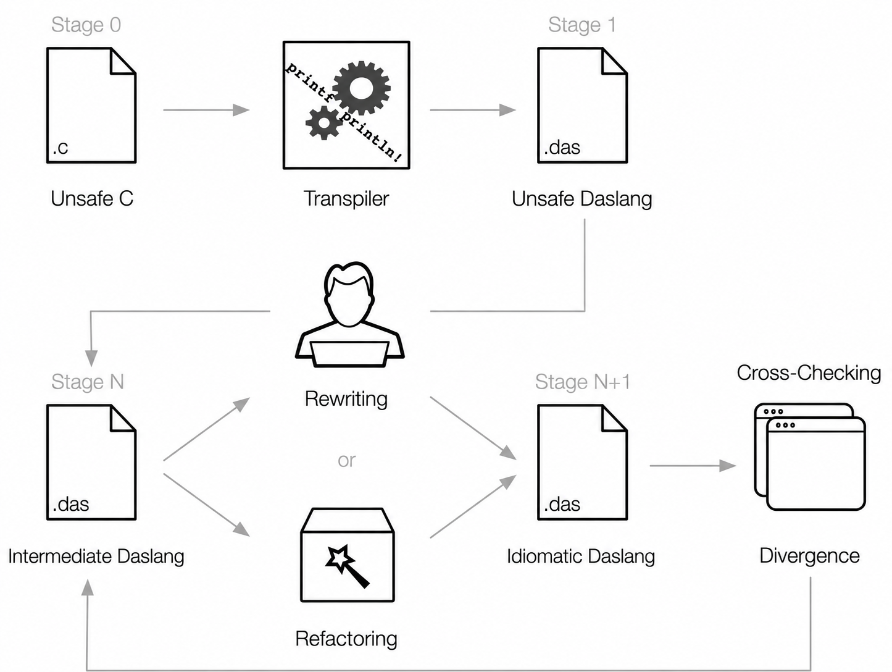

# Translator overview: what c2das does, how it is built and how it is validated

This page holds the long-form material that used to open `README.md`: the translator's
contract, the build and translate instructions, the validation layers, the continuous
integration mirror, the development principles and the relationship to C2Rust. The README
keeps the short version and the benchmark snapshot. The live ledgers of what is not yet
supported are `docs/known-limitations.md`, `docs/followups/corpus_status.md` and
`docs/followups/translator_gaps_wasm3.md`; the architecture contracts are
`ARCHITECTURE_COMMON.md`, `REVIEW_COMMON.md`, `LAWS.md` and the `ARCHITECTURE.md` beside each
owner.

## Architecture

```text
Clang AST -> CBOR -> C AST -> translator -> daScript AST -> printer -> .das
```



The translator deliberately keeps C facts separate from daScript representation. In
particular:

- exported Clang facts are the source of truth for C size, alignment, field offsets, padding,
  `packed`, `aligned`, unions, and bitfields;
- the canonical runtime lowers allocation and memory primitives to `c2da_rt_*` calls before
  printing;
- raw addresses, typed pointers, nulls, storage bytes, integer literals, and
  boolean-to-integer conversions use an explicit ABI contract;
- pointer-backed C objects are accessed through address-aware raw-memory lowering, with
  alignment-safe copies for packed or misaligned fields;
- generated daScript is checked by the real `daslang`, not only by Rust snapshot tests.

## What the translator does

- C control flow is rebuilt from the CFG: `for`/`while`/`do`, `switch` with fall-through and
  `default` anywhere, `goto` in any direction, `break` and `continue`, early returns. Loops
  and conditionals that reduce to structured form are printed as `while`/`if`/`break`/
  `continue`; the rest is printed with daScript numeric labels (`label N:` / `goto label N`).
  Function-scope `static` objects are hoisted to module globals.
- Expressions follow C: integer promotion and the usual arithmetic conversions are computed
  from Clang types (`abi.rs`), `short`/`char` wrap in their storage width, `unsigned char`
  promotes to `int`, comma, `&&`/`||` and `?:` evaluate exactly what C evaluates, compound
  assignment and `++`/`--` evaluate their lvalue once, pointer subscripts are signed.
- Literals are exact: double literals print with daslang's `lf` suffix, float literals as
  floats, string literals are NUL-terminated byte arrays with static storage, `'\xff'` is
  `-1`.
- C arrays of constant size are daScript fixed arrays `T[N]` (inline storage, copyable, C
  layout); pointer-backed objects use Clang's layout facts (`sizeof`, `alignof`, `offsetof`,
  padding, packed, bitfields).
- `malloc`/`calloc`/`realloc`/`free`/`memset`/`memcpy`/`memmove`/`memcmp`/`memchr` lower to
  the `c2da_rt_*` runtime prelude emitted into every module. Under `--libc std` the
  translator also replaces the libc calls of a whole program (`printf`, `fopen`, `fread`,
  `clock_gettime`, `argv`, …) with daslib-backed helpers and lowers the C `main`, so the
  translated module is the program (`translator/libc.rs`). Every other external call is a
  strict-mode diagnostic, and so is a file-scope `extern` object that no part of the
  translation unit defines (`p172-extern-object-undefined`): the translator keeps no
  program-wide symbol table, so an object another unit owns is refused rather than declared
  a second time. `extern` followed by a definition in the same unit, and a tentative
  definition (`int g;`), are definitions and translate.
- `--runtime-module <name>` (opt-in) writes that program-wide `c2da_rt_*` prelude — the raw
  heap, the variadic argument cursor and the fixed numeric helpers — once, as the public
  module `<output dir>/<name>.das`, and every translated unit then `require`s it instead of
  carrying its own copy, so several units share one heap. The unit's bodies are unchanged
  (the module passes run before the prelude is split off). The `--libc std` helpers stay in
  each unit: their set is chosen per unit from the calls it makes and built on the unit's
  own Clang target facts. Without the flag the output is exactly the single-module layout.
- `--module-layout source` (opt-in; `unity`, the default, is the layout above) takes a
  `compile_commands.json` and writes one `module <stem>` per `.c` file. A link pre-pass reads
  every unit's Clang AST first: it records the external functions and objects each unit
  defines and the ones it uses, refuses two definitions of one symbol, and refuses a module
  that would `require` the module defining `main`. Each unit then
  `require`s the modules owning the symbols it uses, so a call or an `extern` object that
  the single-module layout rejects resolves there, spelled by its C name (a name daslang would
  rename, such as `print`, fails closed); a C `static` function or object, and every
  generated per-unit helper, is `private`. The runtime prelude, the C type section (records,
  aliases, enumerations and the enumeration-constant `let`s, so one C type is one daslang
  type on both sides of a call) and the `--libc std` helpers — the one `errno` cell and the
  one set of stream tables — go to the shared module, `--runtime-module <name>` or
  `c2da_runtime` by default; a type or std helper two units declare differently fails
  closed (an opaque `struct S;` defers to the unit that completes it). The unit defining
  `main` stays an anonymous module and is the file to run.
  Units that reference each other in a cycle (a strongly connected component of the unit
  graph; daslang refuses a cyclic `require`) are compiled as one module, a cluster: the file
  `<lexically first member stem>_cluster.das` — or `<entry stem>.das`, anonymous, for the
  cluster holding `main` — carries the header, the options and the union of the members'
  `require`s and `include`s each member's fragment `<stem>.das.inc` (declarations only), in
  compilation-database order except that a fragment whose object initializers reach another
  fragment's objects is included after it. The fragment extension is not `.das` because a
  fragment is not a program on its own and a tool that compiles every `.das` file of a
  directory standalone, such as the EdenSpark editor, must not pick it up; daslang's
  `include` takes any file name. The members share one module scope, so the renamer of each
  member reserves the external symbols its mates define and every name the earlier members
  (database order) declared: a same-named C `static`, string-literal array or generated helper
  is renamed (`plr` / `plr_0`), and stays `private`. A C type name two units define at
  different places (a file-local `typedef struct {..} anim_t;` in each) keeps its name at the
  lexically first place and becomes `anim_t_0`, `anim_t_1`, ... at the others, in every
  layout-source program; an anonymous record is `Unnamed_<file>_<line>` of its definition.
  An identical fixed-name helper is declared once; a different one fails closed. Doom
  (`doomgeneric-demo1-std-source`, 83 units) lays out as 28 single-unit modules, a 51-unit
  cluster `am_map_cluster.das`, a 3-unit cluster `i_system_cluster.das` and `c2da_runtime.das`.
- Function pointers are typed daScript function values called through `invoke`;
  `__builtin_popcount/clz/ctz/ffs/bswap*/*_overflow/expect` and a few more have real
  lowerings, every other builtin is a diagnostic.
- The daScript printer renders the AST only: parenthesisation comes from a precedence table
  transcribed from the daslang grammar, and there is no text-level repair.

Unsupported semantics must fail with a precise translation diagnostic rather than silently
becoming an approximation. A construct that translates and compiles but behaves differently
from C is a bug, and the fix belongs in the translator, never in the generated text.

## Known gaps

The live list is `docs/known-limitations.md` and the follow-up ledgers under
`docs/followups/`. Recorded here from the 2026-09 audit, still open unless a ledger says
otherwise:

- `_Atomic` is lowered as its plain type; `volatile`, SIMD vectors, inline asm, `long
  double`, `__int128` and packed structs by value are diagnostics.
- The runtime heap is a 1 GiB reserved arena (address space, not memory) with 16-byte-aligned
  blocks and reuse of freed blocks; the `memset`/`memcmp`/`memchr` routines are interpreted
  loops. It is correct, not fast.
- `va_list` forwarding to another function is rejected.
- The four translator gaps exposed by wasm3 are in `docs/followups/translator_gaps_wasm3.md`.

## What is verified

There is no readiness percentage. The only claims made are the ones the canonical runner
reproduces from fresh output on the real `daslang`:

```sh
python3 scripts/run_c2das_cases.py --all-ready      # every ready case: C reference == fresh daScript
python3 scripts/run_c2das_cases.py --all-known-red  # survey of cases expected to fail
python3 scripts/run_c2das_cases.py --list           # every case and its status
```

- The ready cases in [`tests/canonical/cases.json`](../tests/canonical/cases.json): the
  raw-memory/ABI suite `p17`–`p41`, the audit acceptance suite from `p42` on (loops,
  `switch`, `goto`, `static` locals, function pointers, evaluation order, C integer semantics,
  floating point, printer precedence and literals, arrays, the `--libc std` programs), the
  legacy `tests/syntax` programs (`c*`, `d*`, `g*`, `p01`–`p10`, `s*`, `t*`, `u*`, `test_*`),
  which use their own `main` as the oracle, and the corpus cases (the `corpus` blocks:
  pl_mpeg, h264bsd + minimp4, wasm3, binjgb, doomgeneric).
- The negative cases prove that an unknown external call, an unsupported builtin, an
  unrepresentable field type, a variadic function-pointer call and the like are rejected
  under `--strict` with the declared diagnostic and produce no output.
- `python3 scripts/run_c2das_cases.py --list` is the count; the README does not carry one.
- The last translation of every case is kept for reading and linting in
  `.c2das-out/latest/<case-id>/canonical/` (git-ignored; `C2DAS_LATEST_DIR` moves it), with a
  `TRANSLATION.json` naming the commit and the translator command. `corpus_matrix.py` keeps
  its translations beside it as `matrix-<variant>/`. Each run replaces the previous copy of
  that case and variant, and a translation is kept even when its program then fails.

On the inherited c2rust unit fixtures (`tests/unit/*/src/*.c`, not part of the gate) a survey
of 2026-09-06 found strict translation accepting 66 of 97 and 49 of those compiling with
`daslang`; 7 of the rejections were Clang errors in intentionally invalid inputs, the rest
honest diagnostics (`printf`/`strlen` without a lowering — since lowered under `--libc std`
— `__builtin_alloca`, vector fields, flexible array members, inline asm, statement
expressions with declarations). The survey has not been repeated since.

## Build and translate

The public name is `c2das`, but the current internal Cargo packages and binaries remain
`c2dascript` for compatibility.

Prerequisites on Linux: rustup (the pinned nightly is picked up from `rust-toolchain.toml`),
LLVM/Clang 18 development packages, cmake, a C++ compiler, python3, and a built
[daScript](https://github.com/GaijinEntertainment/daScript) checkout. `llvm-config-N` is
discovered on `PATH`; set `LLVM_CONFIG_PATH` only when several versions are installed.
`daslang` is discovered via `DASLANG`, `DASROOT`, `PATH`, or `~/daScript`.

```sh
sudo apt-get install llvm-18-dev libclang-18-dev clang-18 cmake g++ python3
git clone https://github.com/GaijinEntertainment/daScript ~/daScript
cmake -S ~/daScript -B ~/daScript/build -DCMAKE_BUILD_TYPE=Release
cmake --build ~/daScript/build --target daslang -j
```

Build and run the Rust workspace tests from any checkout of this repository:

```sh
cargo test --workspace
```

Translate one C source file. The generated `.das` is written beside the C source file:

```sh
cargo run -q -p c2dascript-transpile -- --file tests/syntax/p17_runtime_malloc.c
```

For a real project, prefer its exact compilation database:

```sh
cargo run -q -p c2dascript-transpile -- path/to/compile_commands.json
```

Extra arguments after the input are passed to Clang. They must describe the real C build:
target, include paths, defines, and sysroot all affect the AST and therefore the translated
program. `--libc std` translates a whole program including its `main`; `--strict` turns every
unsupported construct into a hard error. `--runtime-module <name>` writes the shared runtime
prelude once as `<output dir>/<name>.das` (the name must be a daslang identifier) and makes
each translated unit `require` it; run the unit's `.das` from that directory as usual.
`--module-layout source` needs a `compile_commands.json` (not `--file`), implies the shared
runtime module (`c2da_runtime` unless `--runtime-module` names it) and writes every unit,
cluster file, fragment and the shared module into one directory; run the unit that defines
`main` (or the cluster file named after it) from there.

Target switches for the EdenSpark editor's daslang (plan: [`eden-flags.md`](eden-flags.md);
sandbox rules: [`eden-target.md`](eden-target.md)). All are opt-in; without them the output
is unchanged.

- `--float-compare nan-safe` routes every `float`/`double` `==`, `!=`, `<`, `<=`, `>`, `>=`
  the translator writes for C (binary operators, truthiness, `!x`) through `[inline]`
  `c2da_fcmp_*` helpers that test NaN by bits (`daslib/math_bits`) first. Proved on master
  daslang by `p190-float-compare-nan-safe` (C and daslang agree, NaN operands included).
- `--dialect eden-0.6.4` checks the finished module and fails with a `TranslationError` on an
  `options` line outside the sandbox list, a `require` of a refused module (`daslib/fio`, so
  any `--libc std` program today), a `!` original operator or a `memmove` builtin call. A
  construct inside a declaration is located at that C declaration.
- `--no-unsafe` fails on any `unsafe`, `addr`, `reinterpret`, `intptr` or `delete` node in the
  output, naming the first ten sites with the C declaration that owns each.
  `--no-unsafe=report` prints a per-construct census (C-owned vs translator-generated) and
  the ten declarations with the most sites to stderr, and writes the module.
- `--records typed` is parsed and refused by name (`... is not implemented yet`, exit 2)
  before any output is written, and so are `--fnptr-model table`, `--varargs-model heap`,
  `--heap-reserve` and `--entry eden` without `--memory-model linear` (`... (needs
  --memory-model linear)`). `--target eden` sets all of them, so it is refused too until
  `--records typed` lands. Status per switch: `docs/eden-flags.md`.
- `scripts/eden_check.py <generated dir>` compiles every generated module under a local
  sandbox model (`EDEN_SANDBOX_PROJECT=<sandbox.das_project>`) and prints a text census.

## Validation pipeline

Validation is layered. A rendered file that merely parses is not a passing translation.

1. The canonical case runner copies each C graph to a temporary workspace, compiles its C
   reference with `clang-18`, and requires fresh strict c2das output there.
2. `daslang` runs the fresh daScript output and compares its stdout and exit code either to
   the declared oracle or, for `"oracle": "c-reference"` cases, to what the C program itself
   produced.
3. Negative cases must fail strict translation with the declared diagnostic and write
   nothing.
4. Rust tests cover the exporter boundary, the ABI/render contracts (`ptr_tests`),
   architecture rules, and insta snapshots of the printed output (or of the diagnostic for
   rejected inputs); they translate into temporary directories and never write into the
   source tree.
5. The corpus matrix (`scripts/corpus_matrix.py`) runs every corpus case in every daslang
   mode and requires per-frame equality with the C reference (`converge --check` is the
   gate); `bench` times the same programs.

```sh
python3 scripts/run_c2das_cases.py --all-ready        # the gate
python3 scripts/run_c2das_cases.py --case p43-switch  # one case
python3 scripts/run_c2das_cases.py --all-known-red    # survey expected failures
cargo test -p c2dascript-transpile                    # Rust suite
python3 scripts/check_test_registry.py --check        # fixture registry is derived from cases.json
python3 scripts/corpus_matrix.py converge --check     # every corpus case, every mode, per frame
python3 scripts/lint_translated.py                    # daslang lint of .c2das-out/latest -> docs/lint-translated.md
```

`daslang` is found through `DASLANG=/path/to/daslang`, `DASROOT`, the pinned toolchain under
`tmp/daslang-toolchain` (see `scripts/setup_daslang_toolchains.sh`), `PATH`, or `~/daScript`.
The registry in `tests/registry/fixtures.json` exposes every remaining fixture's exact status
instead of treating it as covered.

### Continuous integration

The authoritative gate is the local preflight, run from a Git checkout:
`bash scripts/c2das_preflight.sh` (`--fast` by default; `--full` adds the workspace tests,
`--extended` the corpus ledger, PLMPEG end to end and the four-mode corpus convergence
check). GitHub Actions mirrors part of it and proves less:

- `ci` (ubuntu-22.04, Clang 18) runs rustfmt, a release build, the workspace tests except the
  inherited `c2rust-transpile` and `das_ast` suites, the test-registry check, the
  `c2dascript-transpile` contract and snapshot tests, and checks that the tests left no
  untracked files. It runs no daScript.
- `c2das-runtime` (ubuntu-24.04) builds an interpreter-only daScript at the pinned
  `lookibed/daScript` revision, caches it by revision and configure flags, and runs
  `scripts/c2das_preflight.sh --fast`. JIT, AOT and `-exe` are not built, so the corpus run
  modes are covered only locally.

A green workflow is not a substitute for the local preflight.

## Development principles

- Keep the C2Rust architecture where it provides a sound front-end model; port mechanisms,
  not Rust-specific output assumptions.
- Make one canonical owner for every ABI rule. Do not spread pointer casts, layout
  arithmetic, or memory conversion policy across expression lowering.
- Treat Clang layout metadata as C ABI truth. daScript struct layout is a different contract
  unless a representation has been explicitly proven safe.
- Prefer raw-memory operations for pointer-backed objects and union storage. Do not replace
  them with identity casts or direct union field access.
- A known unsupported feature must produce a location-rich diagnostic. A plausible-looking
  but semantically wrong `.das` is a bug.
- Every foundational feature requires Rust AST/render assertions and actual `daslang`
  execution before it is considered complete.
- When a translator change trades readability of the generated daslang for interpreter
  speed, speed wins; the generated text is evidence, not source.

## Relationship to C2Rust

c2das began as a fork of C2Rust and retains substantial C2Rust front-end and translator
architecture. C2Rust is the reference for analysing Clang AST, preserving C semantics,
handling control flow, and organising a durable translator. c2das differs at the target
boundary: it constructs daScript AST, has a daScript printer, and owns a target-specific
raw-memory runtime and ABI layer. `docs/c2rust_parity_map.md` and
`docs/c2rust_to_c2dascript_map.md` map the two.

## Contributing

Issues and patches should describe the C input, Clang invocation, generated daScript, and
the result from the real `daslang` run. Small reproductions in `tests/syntax` are preferred
over textual workarounds. New semantics should extend the canonical layer that owns the
behaviour and add an executable fixture. A daslang-side defect found on the way is filed on
the `lookibed/daScript` fork and recorded in the follow-up ledger that measured it.
